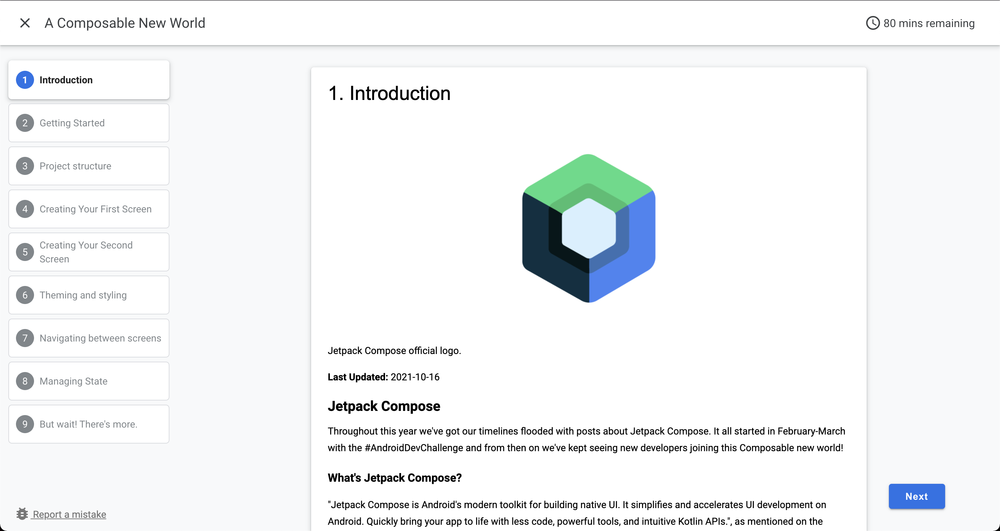

# A Composable New World!

Compose is here! 🙌

I've created a codelab where you can follow step by step the development of android application using Compose:

👉 [Codelab](https://cmota.github.io/a-composable-new-world/)

👉 [Presentation](https://speakerdeck.com/cmota/a-composable-new-world)

👉 [Unsplash app for other platforms](https://github.com/cmota/unsplash)

It's also worth to mention that Compose is getting Multiplatform! If you want to know more about this check a template that I've created - _alicerce_ which uses Kotlin Multiplatform to share the business logic and Compose to share the UI.

<h3 align="center">
  
</h3>
